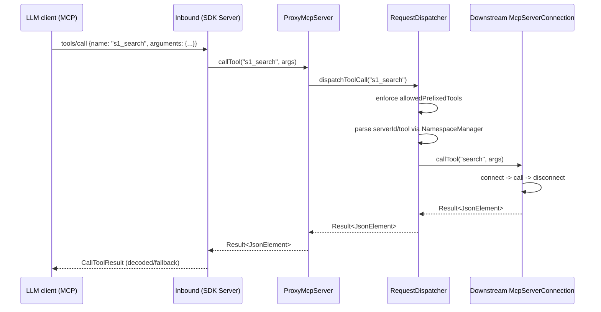

# Broxy architecture (clean architecture + MCP proxy)

## Goal

Broxy is a proxy for Model Context Protocol (MCP) that:

- connects to multiple downstream MCP servers (STDIO, HTTP SSE, Streamable HTTP, WebSocket);
- aggregates their capabilities (tools, prompts, resources);
- applies a preset allow list and publishes a filtered capabilities view;
- routes inbound RPCs (`tools/call`, `prompts/get`, `resources/read`) to the correct downstream server.

## Modules and layers

### `core/` (domain + data + runtime wiring)

Platform-independent proxy logic and models:

- Proxy and routing:
    - `core/src/commonMain/kotlin/io/qent/broxy/core/proxy/ProxyMcpServer.kt`
    - `core/src/commonMain/kotlin/io/qent/broxy/core/proxy/RequestDispatcher.kt`
    - `core/src/commonMain/kotlin/io/qent/broxy/core/proxy/ToolFilter.kt`
    - `core/src/commonMain/kotlin/io/qent/broxy/core/proxy/NamespaceManager.kt`
- Downstream MCP connections:
    - `core/src/commonMain/kotlin/io/qent/broxy/core/mcp/DefaultMcpServerConnection.kt`
    - `core/src/jvmMain/kotlin/io/qent/broxy/core/mcp/clients/StdioMcpClient.kt`
    - `core/src/jvmMain/kotlin/io/qent/broxy/core/mcp/clients/KtorMcpClient.kt`
    - `core/src/jvmMain/kotlin/io/qent/broxy/core/mcp/IsolatedMcpServerConnection.kt`
- Configuration and hot reload:
    - `core/src/jvmMain/kotlin/io/qent/broxy/core/config/JsonConfigurationRepository.kt`
    - `core/src/jvmMain/kotlin/io/qent/broxy/core/config/ConfigurationWatcher.kt`
    - `core/src/jvmMain/kotlin/io/qent/broxy/core/config/EnvironmentVariableResolver.kt`
- Runtime wiring (JVM):
    - `core/src/commonMain/kotlin/io/qent/broxy/core/proxy/runtime/ProxyRuntimeFacade.kt`
    - `core/src/commonMain/kotlin/io/qent/broxy/core/proxy/runtime/ProxyLifecycle.kt`
    - `core/src/jvmMain/kotlin/io/qent/broxy/core/proxy/runtime/ProxyControllerJvm.kt`
    - `core/src/jvmMain/kotlin/io/qent/broxy/core/proxy/inbound/InboundServers.kt`
    - `core/src/jvmMain/kotlin/io/qent/broxy/core/proxy/inbound/SdkServerFactory.kt`

### `ui-adapter/` (presentation adapter, UDF/MVI)

Presentation layer without Compose dependencies: state, intents, and background jobs.

- Store and intents:
    - `ui-adapter/src/commonMain/kotlin/io/qent/broxy/ui/adapter/store/AppStore.kt`
    - `ui-adapter/src/commonMain/kotlin/io/qent/broxy/ui/adapter/store/internal/AppStoreIntents.kt`
    - `ui-adapter/src/commonMain/kotlin/io/qent/broxy/ui/adapter/store/internal/ProxyRuntime.kt`
- AI client connectors:
    - `ui-adapter/src/commonMain/kotlin/io/qent/broxy/ui/adapter/clients/AiClientConnector.kt`
    - `ui-adapter/src/jvmMain/kotlin/io/qent/broxy/ui/adapter/clients/`
- Remote mode (OAuth + WebSocket) wiring:
    - `ui-adapter/src/commonMain/kotlin/io/qent/broxy/ui/adapter/remote/RemoteConnector.kt`
    - `ui-adapter/src/jvmMain/kotlin/io/qent/broxy/ui/adapter/remote/RemoteConnectorFactoryJvm.kt`
    - `ui-adapter/src/jvmMain/kotlin/io/qent/broxy/ui/adapter/remote/BroCloudRemoteConnectorAdapter.kt`
    - UI hides remote controls when the remote connector is unavailable.
    - When authorized, the global header shows the account label (opens https://broxy.run/login), a cloud status icon
      to connect/disconnect, and a logout button that keeps the theme color.
    - Preset changes trigger remote WebSocket notifications so the backend refreshes capabilities
      when adapter mode is disabled. Proxy start/restart also sends the active preset so the
      backend stays in sync. Adapter mode toggles send a notification because the published
      capability surface changes.
- Bro-cloud integration is enabled by default and resolved from the obfuscated jar in `lib/bro-cloud-obfuscated.jar`.
  Configure it in `gradle.properties` with `broCloudEnabled`, and set `broCloudUseLocal=true` to switch back to
  the `bro-cloud/` composite build.
- UI errors surface via `UIState.Error` and persist until a successful configuration refresh clears them.

### UI-adapter boundary (target)

`ui-adapter` depends on `core` through stable contracts plus narrowly scoped JVM wiring:

- contracts: `io.qent.broxy.core.repository`, `io.qent.broxy.core.mcp` (raw capabilities),
  and `io.qent.broxy.core.mcp.auth`
- proxy control: `ProxyRuntimeFacade` + status streams; no direct `ProxyMcpServer` or inbound SDK wiring
- mapping: UI DTOs live in `ui-adapter` (`UiMcpServerConfig`, `UiMcpServersConfig`,
  `UiTransportConfig`, `UiPresetCore`) with `toCore()`/`toUi()` mappers; `core.models` is
  used only inside the mapper layer
- JVM wiring: `ConfigurationManager`, `JsonConfigurationRepository`, `EnvironmentVariableResolver`,
  and logging/cache helpers are used only in platform-specific adapters (see `docs/ui_adapter_boundary.md`)

See `docs/ui_adapter_boundary.md` for the current inventory and the baseline allowlist.

### `ui/` (Compose Desktop, thin UI)

UI renders `UIState` and calls intents, with no direct dependency on `core`. The navigation rail status
indicator and the tray menu expose a click target that toggles the local HTTP inbound server.
Navigation keeps server sub-views (list/editor/capabilities) under the MCP entry; selecting MCP always returns to the server list. Preset sub-views return to the preset list when the Presets menu item is selected.
On macOS the window uses a transparent title bar; the global header exposes draggable regions only in the empty space around header controls. Background dragging is disabled (`apple.awt.draggableWindowBackground`) so only explicit drag areas move the window.
Server and preset list cards support drag-and-drop reordering; the UI persists the new order via `ui-adapter` intents.

### `headless-runtime/` (STDIO proxy entrypoint)

Headless JVM entrypoint for packaged Desktop app STDIO mode:

- `headless-runtime/src/main/kotlin/io/qent/broxy/headless/HeadlessEntrypointJvm.kt`
- used by the Desktop app to act as an MCP STDIO server without CLI args
- keeps runtime wiring (ProxyMcpServer + SDK server sync) out of `ui-adapter`

### `cli/` (CLI mode)

CLI starts the proxy and the configuration watcher:

- `cli/src/main/kotlin/io/qent/broxy/cli/commands/ProxyCommand.kt`

See `docs/cli_mode.md` for CLI flags, defaults, logging, and hot reload details.

### `test-mcp-server/` (integration test target)

Lightweight MCP server used by CLI/integration tests and self-checks:

- `test-mcp-server/src/main/kotlin/io/qent/broxy/test/mcp/`
- supports STDIO, Streamable HTTP, HTTP SSE, and WebSocket modes

See `docs/test_mcp_server_status.md` for the self-check contract and capability details.

## End-to-end flows

### 1) Start proxy (CLI or UI)

1. Load configuration (`mcp.json`) and preset (`preset_<id>.json`); desktop UI also loads
   UI-only settings from `ui.json`.
2. Build runtime:
    - downstream connections: `DefaultMcpServerConnection` for each enabled server;
    - proxy core: `ProxyMcpServer`;
    - inbound server: STDIO or HTTP (Streamable + SSE endpoint at `/sse`) (`InboundServerFactory`).
3. `ProxyMcpServer.start(...)` stores the preset and returns immediately. For STDIO
   inbound, Broxy waits for the initial downstream capability refresh across all
   enabled servers before starting the inbound session so the first list calls
   are populated. For HTTP inbound, downstream capabilities are refreshed
   asynchronously per server with concurrency limits. A background refresh loop
   (from `capabilitiesRefreshIntervalSeconds`) retries missing/failed servers and
   keeps capabilities fresh.
4. The inbound adapter builds an MCP SDK `Server` via `buildSdkServer(proxy)` and exposes
   `tools/list`, `prompts/list`, `resources/list`, and handlers for `callTool/getPrompt/readResource`.

### 2) Tool call (LLM -> Broxy -> downstream)

Key contract: inbound tool names must be prefixed as `serverId_toolName`.

```mermaid
sequenceDiagram
  participant LLM as LLM client (MCP)
  participant Inbound as Inbound (SDK Server)
  participant Proxy as ProxyMcpServer
  participant Disp as RequestDispatcher
  participant DS as Downstream McpServerConnection

  LLM->>Inbound: tools/call {name: "s1_search", arguments: {...}}
  Inbound->>Proxy: callTool("s1_search", args)
  Proxy->>Disp: dispatchToolCall("s1_search")
  Disp->>Disp: enforce allowedPrefixedTools
  Disp->>Disp: parse serverId/tool via NamespaceManager
  Disp->>DS: callTool("search", args)
  DS->>DS: connect -> call -> disconnect
  DS-->>Disp: Result<JsonElement>
  Disp-->>Proxy: Result<JsonElement>
  Proxy-->>Inbound: Result<JsonElement>
  Inbound-->>LLM: CallToolResult (decoded/fallback)
```

### 3) Hot reload (config/preset)

`ConfigurationWatcher` is used in CLI:

- `mcp.json` change -> `onConfigurationChanged(...)` -> `ProxyLifecycle.updateServers(...)`.
- `preset_*.json` change -> `onPresetChanged(...)` -> `ProxyLifecycle.applyPreset(...)`.

Inbound does not restart; the SDK server is re-synced with the new filtered capabilities.
Desktop UI reloads configuration via `AppStore.refresh()` and does not wire `ConfigurationWatcher` by default.
