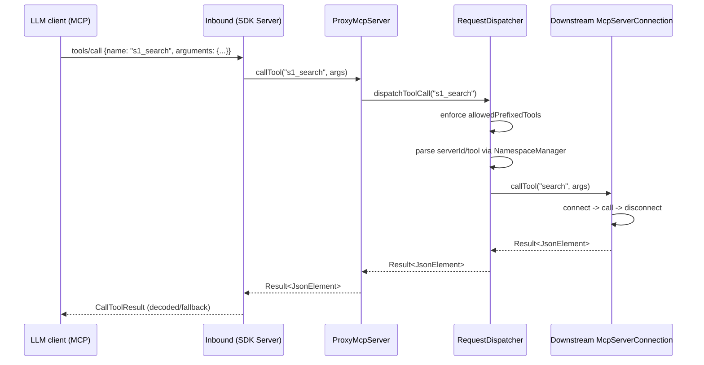

# Broxy architecture (clean architecture + MCP proxy)

## Purpose

Provide a high-level system map of Broxy modules, runtime composition, and end-to-end flows.

## When to read

- First orientation in the repository.
- Before changing cross-module behavior or ownership boundaries.

## Source-of-truth files

- `settings.gradle.kts`
- `core/src/commonMain/kotlin/io/qent/broxy/core/proxy/runtime/ProxyLifecycle.kt`
- `core/src/jvmMain/kotlin/io/qent/broxy/core/proxy/runtime/ProxyControllerJvm.kt`
- `ui-adapter/src/commonMain/kotlin/io/qent/broxy/ui/adapter/store/AppStore.kt`

## Behavior contract

This file is architectural and intentionally high-level. Detailed behavior contracts are canonical in:
`docs/proxy_facade.md`, `docs/inbound_transports.md`, `docs/presets_and_filtering.md`,
`docs/configuration_and_hot_reload.md`, and `docs/remote_auth_and_websocket.md`.

## Goal

Broxy is a proxy for Model Context Protocol (MCP) that:

- connects to multiple downstream MCP servers (STDIO, HTTP SSE, Streamable HTTP, WebSocket);
- aggregates their capabilities (tools, prompts, resources);
- applies a preset allow list and publishes a filtered capabilities view;
- routes inbound RPCs (`tools/call`, `prompts/get`, `resources/read`) to the correct downstream server.

## Modules and layers

### `core/` (domain + data + runtime wiring)

Platform-independent proxy logic and models:

- Proxy and routing:
    - `core/src/commonMain/kotlin/io/qent/broxy/core/proxy/ProxyMcpServer.kt`
    - `core/src/commonMain/kotlin/io/qent/broxy/core/proxy/RequestDispatcher.kt`
    - `core/src/commonMain/kotlin/io/qent/broxy/core/proxy/ToolFilter.kt`
    - `core/src/commonMain/kotlin/io/qent/broxy/core/proxy/NamespaceManager.kt`
- Downstream MCP connections:
    - `core/src/commonMain/kotlin/io/qent/broxy/core/mcp/DefaultMcpServerConnection.kt`
    - `core/src/jvmMain/kotlin/io/qent/broxy/core/mcp/clients/StdioMcpClient.kt`
    - `core/src/jvmMain/kotlin/io/qent/broxy/core/mcp/clients/KtorMcpClient.kt`
    - `core/src/jvmMain/kotlin/io/qent/broxy/core/mcp/IsolatedMcpServerConnection.kt`
- Configuration and hot reload:
    - `core/src/jvmMain/kotlin/io/qent/broxy/core/config/JsonConfigurationRepository.kt`
    - `core/src/jvmMain/kotlin/io/qent/broxy/core/config/ConfigurationWatcher.kt`
    - `core/src/jvmMain/kotlin/io/qent/broxy/core/config/EnvironmentVariableResolver.kt`
- Runtime wiring (JVM):
    - `core/src/commonMain/kotlin/io/qent/broxy/core/proxy/runtime/ProxyRuntimeFacade.kt`
    - `core/src/commonMain/kotlin/io/qent/broxy/core/proxy/runtime/ProxyLifecycle.kt`
    - `core/src/jvmMain/kotlin/io/qent/broxy/core/proxy/runtime/ProxyControllerJvm.kt`
    - `core/src/jvmMain/kotlin/io/qent/broxy/core/proxy/inbound/InboundServers.kt`
    - `core/src/jvmMain/kotlin/io/qent/broxy/core/proxy/inbound/SdkServerFactory.kt`

### `server-registry/` (catalog domain + data)

Registry/catalog module with clean contracts and repository implementation:

- Catalog schema/models/planner:
    - `server-registry/src/commonMain/kotlin/io/qent/broxy/registry/catalog/CatalogSchema.kt`
    - `server-registry/src/commonMain/kotlin/io/qent/broxy/registry/catalog/CatalogUiModels.kt`
    - `server-registry/src/commonMain/kotlin/io/qent/broxy/registry/catalog/CatalogInstallPlanner.kt`
- Catalog repository:
    - `server-registry/src/commonMain/kotlin/io/qent/broxy/registry/data/CatalogRepository.kt`
    - `server-registry/src/jvmMain/kotlin/io/qent/broxy/registry/data/GithubCatalogRepository.kt`
- Build-time bundled catalog resource:
    - task `:server-registry:generateBundledCatalog` generates `catalog/catalog_bundle.json`
    - on fetch failure, fallback seed is `server-registry/catalog-seed/catalog_bundle.json`

### `ui-adapter/` (presentation adapter, UDF/MVI)

Presentation layer without Compose dependencies: state, intents, and background jobs.

- Store and intents:
    - `ui-adapter/src/commonMain/kotlin/io/qent/broxy/ui/adapter/store/AppStore.kt`
    - `ui-adapter/src/commonMain/kotlin/io/qent/broxy/ui/adapter/store/internal/AppStoreIntents.kt`
      (thin facade delegating to feature handlers)
    - `ui-adapter/src/commonMain/kotlin/io/qent/broxy/ui/adapter/store/internal/ServerIntentsHandler.kt`
    - `ui-adapter/src/commonMain/kotlin/io/qent/broxy/ui/adapter/store/internal/PresetIntentsHandler.kt`
    - `ui-adapter/src/commonMain/kotlin/io/qent/broxy/ui/adapter/store/internal/CatalogImportIntentsHandler.kt`
    - `ui-adapter/src/commonMain/kotlin/io/qent/broxy/ui/adapter/store/internal/RuntimeSettingsIntentsHandler.kt`
    - `ui-adapter/src/commonMain/kotlin/io/qent/broxy/ui/adapter/store/internal/IntegrationsIntentsHandler.kt`
    - `ui-adapter/src/commonMain/kotlin/io/qent/broxy/ui/adapter/store/internal/IntentExecutionContext.kt`
    - `ui-adapter/src/commonMain/kotlin/io/qent/broxy/ui/adapter/store/internal/StoreConfigGateway.kt`
    - `ui-adapter/src/commonMain/kotlin/io/qent/broxy/ui/adapter/store/internal/ProxyRuntime.kt`
- MCP catalog:
    - `ui-adapter/src/commonMain/kotlin/io/qent/broxy/ui/adapter/catalog/` (compatibility facade + planner adapter)
    - `ui-adapter/src/commonMain/kotlin/io/qent/broxy/ui/adapter/data/CatalogRepository.kt` (adapter-side contract alias)
    - `ui-adapter/src/jvmMain/kotlin/io/qent/broxy/ui/adapter/data/RepositoriesJvm.kt` wires
      `GithubCatalogRepository` from `server-registry`
    - runtime startup refresh still checks GitHub updates asynchronously via `HEAD index.json`
      (`Last-Modified`) and downloads catalog payloads only when metadata changes
- Desktop system picker:
    - `ui-adapter/src/commonMain/kotlin/io/qent/broxy/ui/adapter/data/SystemPicker.kt`
    - `ui-adapter/src/jvmMain/kotlin/io/qent/broxy/ui/adapter/data/SystemPickerJvm.kt`
    - shared by agent workspace directory selection and server icon file selection
- AI client connectors:
    - `ui-adapter/src/commonMain/kotlin/io/qent/broxy/ui/adapter/clients/AiClientConnector.kt`
    - `ui-adapter/src/jvmMain/kotlin/io/qent/broxy/ui/adapter/clients/`
    - connector contract includes `loadImportableServers()` for normalized MCP import entries.
    - `AppStore` runs background scans for importable MCP servers on start and after refresh/reset actions.
    - scan results are filtered (`broxy` excluded, malformed entries skipped), sorted by client/server name,
      and exposed in `UIState.Ready.importedServerGroups`.
    - hidden imported sources are persisted outside JSON config in OS storage
      (`ui-adapter/.../ImportedServerHideRepository`, JVM backing: `java.util.prefs.Preferences`).
- Remote mode (OAuth + WebSocket) wiring:
    - `ui-adapter/src/commonMain/kotlin/io/qent/broxy/ui/adapter/remote/RemoteConnector.kt`
    - `ui-adapter/src/jvmMain/kotlin/io/qent/broxy/ui/adapter/remote/RemoteConnectorFactoryJvm.kt`
    - `ui-adapter/src/jvmMain/kotlin/io/qent/broxy/ui/adapter/remote/BroCloudRemoteConnectorAdapter.kt`
    - UI hides remote controls when the remote connector is unavailable.
    - When authorized, the global header shows the account label (opens https://broxy.run/login), a cloud status icon
      to connect/disconnect, and a logout button that keeps the theme color.
    - Preset changes trigger remote WebSocket notifications so the backend refreshes capabilities
      when adapter mode is disabled. Proxy start/restart also sends the active preset so the
      backend stays in sync. Adapter mode toggles send a notification because the published
      capability surface changes.
- Bro-cloud integration is disabled by default and resolved from the obfuscated jar in `lib/bro-cloud-obfuscated.jar`
  when enabled. Configure it in `gradle.properties` with `broCloudEnabled=true`, and set
  `broCloudUseLocal=true` to switch back to the `bro-cloud/` composite build.
- UI errors surface via `UIState.Error` and persist until a successful configuration refresh clears them.

### `agents/` (agent domain + LangChain runtime module)

Dedicated JVM module for reactive agent execution and schedules:

- contracts and models:
    - `agents/src/main/kotlin/io/qent/broxy/agents/AgentContracts.kt`
    - `agents/src/main/kotlin/io/qent/broxy/agents/AgentModels.kt`
- application:
    - `agents/src/main/kotlin/io/qent/broxy/agents/application/DefaultAgentService.kt`
      (CRUD + run + overlap policy + run trace persistence + app-level AI feature execution)
    - `agents/src/main/kotlin/io/qent/broxy/agents/application/HybridAgentExecutor.kt` (runtime dispatch)
    - `agents/src/main/kotlin/io/qent/broxy/agents/application/scheduler/CronAgentScheduler.kt` (UNIX cron schedules)
- infrastructure:
    - `agents/src/main/kotlin/io/qent/broxy/agents/infrastructure/persistence/JsonAgentRepository.kt`
      (Claude markdown definitions `~/.config/broxy/agents/<id>.md` or external directory from
      `agents_settings.json.agentsDirectoryPath`, plus sidecar metadata in `~/.config/broxy/agents/metadata/agent_<id>.json`)
    - `agents/src/main/kotlin/io/qent/broxy/agents/infrastructure/persistence/JsonAgentRunRepository.kt`
      (`~/.config/broxy/agents/runs/run_<runId>.json` + `~/.config/broxy/agents/runs_index.json`)
    - `agents/src/main/kotlin/io/qent/broxy/agents/infrastructure/persistence/JsonAgentProviderSettingsRepository.kt`
      (`~/.config/broxy/agents/agents_settings.json`, endpoint overrides + model cache + agents directory path)
    - `agents/src/main/kotlin/io/qent/broxy/agents/infrastructure/secrets/AgentSecretsStoreJvm.kt`
      (secure storage + `~/.config/broxy/agents/agents_secrets.json` fallback)
- runtime:
    - `agents/src/main/kotlin/io/qent/broxy/agents/runtime/langchain/LangChain4jAgentExecutor.kt`
      (provider model + `langchain4j-agentic` tool loop via `AgenticServices`)
    - `agents/src/main/kotlin/io/qent/broxy/agents/runtime/mcp/ScopedMcpConnectionsFactory.kt`
      (scoped downstream MCP connections + OAuth snapshot binding)
    - filesystem tooling split into facade + handlers:
      `agents/src/main/kotlin/io/qent/broxy/agents/runtime/filesystem/AgentFileSystemTools.kt` +
      `agents/src/main/kotlin/io/qent/broxy/agents/runtime/filesystem/*`
      (`AgentFileSystemInspectHandler`, `AgentFileSystemReadHandler`,
      `AgentFileSystemSearchHandler`, `AgentFileSystemEditHandler`,
      shared argument/payload/path/text/line-edit helpers)

### `agents-codex/` (Codex CLI runtime adapter)

Dedicated JVM module for Codex-specific execution runtime and process wrapper:

- `agents-codex/src/main/kotlin/io/qent/broxy/agents/codex/CodexCliExecutor.kt`
- `agents-codex/src/main/kotlin/io/qent/broxy/agents/codex/mcp/AgentRunMcpIsolator.kt`
- `agents-codex/src/main/kotlin/io/qent/broxy/agents/codex/mcp/AgentPortRangeAllocator.kt`
- `agents-codex/src/main/kotlin/io/qent/broxy/agents/codex/runtime/CodexCommandEnvironmentBuilder.kt`
- `agents-codex/src/main/kotlin/io/qent/broxy/agents/codex/runtime/CodexPreflightChecker.kt`
- `agents-codex/src/main/kotlin/io/qent/broxy/agents/codex/runtime/CodexProcessRunner.kt`
- `agents-codex/src/main/kotlin/io/qent/broxy/agents/codex/runtime/CodexJsonlEventMapper.kt`
- `agents-codex/src/main/kotlin/io/qent/broxy/agents/codex/runtime/CodexAuthStateInspector.kt`
- `agents-codex/src/main/kotlin/io/qent/broxy/agents/codex/runtime/CodexAuthRetryPolicy.kt`

`ui-adapter` composes `agents` + `agents-codex` via `AgentGateway` while keeping Compose-free orchestration.
`AppStore.generateAgentDescription(...)` routes create/edit draft generation to `AgentGateway`,
which maps cached capability snapshot context to `AgentDescriptionGenerationCommand`.
`AppStore.startGenerateAgentFromRequest()` routes full agent auto-creation through a 3-stage LLM pipeline,
accepts request-local AI runtime/model override from `Generate Agent` form, keeps generation state in a
dedicated `StateFlow`, enforces single-flight generation, autosaves the generated draft, and publishes
the saved agent id for UI navigation into Edit mode.

### UI-adapter boundary (target)

`ui-adapter` depends on `core` through stable contracts plus narrowly scoped JVM wiring:

- contracts: `io.qent.broxy.core.repository`, `io.qent.broxy.core.mcp` (raw capabilities),
  and `io.qent.broxy.core.mcp.auth`
- proxy control: `ProxyRuntimeFacade` + status streams; no direct `ProxyMcpServer` or inbound SDK wiring
- mapping: UI DTOs live in `ui-adapter` (`UiMcpServerConfig`, `UiMcpServersConfig`,
  `UiTransportConfig`, `UiPresetCore`) with `toCore()`/`toUi()` mappers; `core.models` is
  used only inside the mapper layer
- JVM wiring: `ConfigurationManager`, `JsonConfigurationRepository`, `EnvironmentVariableResolver`,
  and logging/cache helpers are used only in platform-specific adapters (see `docs/ui_adapter_boundary.md`)
- catalog/registry logic is consumed through `server-registry` interfaces and planner contracts;
  `ui` still depends only on `ui-adapter` imports.

See `docs/ui_adapter_boundary.md` for the current inventory and the baseline allowlist.

### `ui/` (Compose Desktop, thin UI)

UI renders `UIState` and calls intents, with no direct dependency on `core`. The navigation rail status
indicator exposes a click target that toggles the local HTTP inbound server, while the tray menu
exposes preset selection (including built-in `No preset` and `All enabled servers`) plus show/exit actions.
On macOS, selecting `Exit` from the tray menu prioritizes immediate app exit; runtime and tray cleanup
run asynchronously on a best-effort basis and do not block the menu action.
On macOS, selecting `Show Broxy` from the tray menu requests app foreground activation first (when
supported by `Desktop.Action.APP_REQUEST_FOREGROUND`) and then falls back to normal window focus calls.
Navigation rail order starts with `Registry`, followed by `MCP`, `Presets`, `Agents`, and `Runs`; the `Connection` entry is an icon-only
button in the bottom block above `Agent Settings` and `Settings`.
On macOS, the standard application menu item `Settings…` (and `Cmd+,` when provided by the system)
opens Broxy `Settings`, reveals the window if it is hidden, and brings it to the foreground.
On macOS, the standard application menu item `About Broxy` opens the native Cocoa About popup
without custom UI overrides. For packaged `.app` builds, macOS reads app name/icon/version/build
from bundle metadata (`CFBundleShortVersionString`/`CFBundleVersion`).
Navigation rail order starts with `Registry`, followed by `MCP` and `Presets`; the `Connection` entry is an icon-only
button in the bottom block above `Settings`.
Navigation keeps server sub-views (list/editor/capabilities) under the MCP entry; selecting MCP always returns to the server list. Preset sub-views return to the preset list when the Presets menu item is selected.
Agents navigation includes a dedicated AI generation sub-screen (`Generate Agent`) opened from the single `+` FAB
when AI generation runtime settings are ready; otherwise the same `+` FAB opens manual agent creation.
The sub-screen state is backed by `AppStore.agentGenerationState` and survives screen switches inside the app.
List cards on Servers, Presets, and Agents screens use the same title/subtitle typography (`titleSmall` + `bodySmall`) and matching vertical spacing between text rows and card bounds.
On app launch, the default active screen is `MCP` (not `Registry`).
On macOS the window uses a transparent title bar; the global header exposes draggable regions only in the empty space around header controls. Background dragging is disabled (`apple.awt.draggableWindowBackground`) so only explicit drag areas move the window.
Text selection context menus in Compose text fields follow the selected app theme (`Light`/`Dark`) instead of staying in a fixed light style.
Server, preset, and agent list cards support drag-and-drop reordering; the UI persists the new order via `ui-adapter` intents.
The Servers screen also renders a plain `Import` section below the main list:
a flat A-Z list of import cards (no client header rows), without a drag handle, with `Import`/`Hide` actions, and
inline client name in the transport row.
On list-style screens, the floating bottom search field is rendered only when at least one row exists in the
underlying list (for example, Servers/Import rows, Presets rows, Catalog rows, or server capabilities).
The Catalog screen renders a separate searchable list of registry cards without drag-and-drop and supports
conditional install flow: one-click install when no required user input is needed, or a schema-driven form
when required fields must be entered. After creating a new server (catalog install, manual editor create,
or imported-server create), the UI returns to the Servers screen with that server placed first in the
persisted server order. The Servers screen then clears local search, instantly scrolls to that server card,
and consumes the single-use focus signal.

### `headless-runtime/` (STDIO proxy entrypoint)

Headless JVM entrypoint for packaged Desktop app STDIO mode:

- `headless-runtime/src/main/kotlin/io/qent/broxy/headless/HeadlessEntrypointJvm.kt`
- used by the Desktop app to act as an MCP STDIO server without CLI args
- keeps runtime wiring (ProxyMcpServer + SDK server sync) out of `ui-adapter`

### `cli/` (CLI mode)

CLI supports:

- long-running proxy mode (`broxy proxy`, with configuration watcher and hot reload);
- one-shot agent mode (`broxy agent run`, no scheduler/daemon).

- `cli/src/main/kotlin/io/qent/broxy/cli/commands/ProxyCommand.kt`
- `cli/src/main/kotlin/io/qent/broxy/cli/commands/AgentRunCommand.kt`

See `docs/cli_mode.md` for CLI flags, defaults, logging, and hot reload details.

### `test-mcp-server/` (integration test target)

Lightweight MCP server used by CLI/integration tests and self-checks:

- `test-mcp-server/src/main/kotlin/io/qent/broxy/test/mcp/`
- supports STDIO, Streamable HTTP, HTTP SSE, and WebSocket modes

See `docs/test_mcp_server_status.md` for the self-check contract and capability details.

## End-to-end flows

### 1) Start proxy (CLI or UI)

1. Load global configuration (`config.json`), resolve `mcpFilePath`, load MCP servers file (`mcp.json`),
   and load preset (`preset_<id>.json`); desktop UI also loads UI-only settings from `ui.json`.
2. Build runtime:
    - downstream connections: `DefaultMcpServerConnection` for each enabled server;
    - proxy core: `ProxyMcpServer`;
    - inbound server: STDIO or HTTP (Streamable + SSE endpoint at `/sse`) (`InboundServerFactory`).
3. `ProxyMcpServer.start(...)` stores the preset and returns immediately. For STDIO
   inbound, Broxy waits for the initial downstream capability refresh across all
   enabled servers before starting the inbound session so the first list calls
   are populated. For HTTP inbound, downstream capabilities are refreshed
   asynchronously per server with concurrency limits. A background refresh loop
   (from `capabilitiesRefreshIntervalSeconds`) retries missing/failed servers and
   keeps capabilities fresh.
4. The inbound adapter builds an MCP SDK `Server` via `buildSdkServer(proxy)` and exposes
   `tools/list`, `prompts/list`, `resources/list`, and handlers for `callTool/getPrompt/readResource`.
   For HTTP/SSE, each inbound client session owns its own SDK `Server` binding:
   default sessions use the main running `ProxyMcpServer`, while `/mcp/{presetId}` and
   `/sse/{presetId}` create lightweight preset-pinned proxy views that share the same downstream
   connections and raw capability snapshots.

### 2) Tool call (LLM -> Broxy -> downstream)

Key contract: inbound tool names must be prefixed as `serverId_toolName`.

```mermaid
sequenceDiagram
  participant LLM as LLM client (MCP)
  participant Inbound as Inbound (SDK Server)
  participant Proxy as ProxyMcpServer
  participant Disp as RequestDispatcher
  participant DS as Downstream McpServerConnection

  LLM->>Inbound: tools/call {name: "s1_search", arguments: {...}}
  Inbound->>Proxy: callTool("s1_search", args)
  Proxy->>Disp: dispatchToolCall("s1_search")
  Disp->>Disp: enforce allowedPrefixedTools
  Disp->>Disp: parse serverId/tool via NamespaceManager
  Disp->>DS: callTool("search", args)
  DS->>DS: connect -> call -> disconnect
  DS-->>Disp: Result<JsonElement>
  Disp-->>Proxy: Result<JsonElement>
  Proxy-->>Inbound: Result<JsonElement>
  Inbound-->>LLM: CallToolResult (decoded/fallback)
```

### 4) Agent run (UI -> Agent service -> LangChain4j -> downstream MCP tools)

1. UI triggers `Intents.runAgent(agentId, prompt, llm, fileSystem, cron?, clearExistingScheduleBeforeRun)`.
2. `ui-adapter` routes to `AgentGateway`:
    - `cron == null` -> immediate run using launch LLM config from the launch form;
      if `clearExistingScheduleBeforeRun == true`, ui-adapter clears existing schedule first and only then starts
      manual run;
    - `cron != null` -> save/update schedule with `cron`, `prompt`, `timezoneId`, and `llm`.
3. `DefaultAgentService` builds an execution request from:
    - selected agent definition;
    - current `mcp.json` (via `ConfigurationRepository`);
    - launch/schedule LLM config (`provider/model/temperature`);
    - launch/schedule filesystem config (`workspace path`, `access level`);
    - provider settings (`baseUrl` + model cache) and secure API key when provider requires it.
4. `LangChain4jAgentExecutor`:
    - resolves `usedServerIds` from the agent capability selection (enabled tools/prompts/resources refs);
    - fetches downstream capabilities only for servers that are both enabled and present in `usedServerIds`;
    - restores persisted OAuth state for scoped HTTP/Streamable HTTP/WebSocket servers and persists updates
      after each connection session;
    - applies copied capability selection (`DefaultToolFilter`);
    - prepares local filesystem workspace sandbox (`/tmp/broxy/agents` is auto-created if missing; missing non-default paths fail);
    - builds local filesystem tool provider by access level:
      - `NONE`: no local tools,
      - `READ_ONLY`: `fsInspect`, `fsRead`, `fsSearch`,
      - `READ_WRITE`: `fsInspect`, `fsRead`, `fsSearch`, `fsEdit`;
    - runs `AgenticServices` (`langchain4j-agentic`) with a `ToolProvider` bridge into
      `DefaultRequestDispatcher` plus local filesystem tools (no custom manual tool loop in the executor).
5. Run result is persisted as a standalone run record (`run_<runId>.json`) plus summary index entry
   (`runs_index.json`) and emitted to UI via update flow (`AgentExecutionUpdate.Finished(run)`).
6. Desktop consumes run-finished updates and may show a system notification (configurable via `ui.json`
   `agentRunNotificationsEnabled`).
   - On macOS, Broxy uses native UserNotifications (`UNUserNotificationCenter`) via a JNI bridge
     (`ui/src/desktopMain/native/macos/broxy_notifications_bridge.m`) and Kotlin adapter
     (`ui/src/desktopMain/kotlin/io/qent/broxy/ui/MacOsNotificationNativeBridge.kt`).
     - Notifications are enabled only in `.app` context; non-bundle launches (IDE/Gradle JVM) skip calls to
       `UNUserNotificationCenter` to avoid runtime crashes (`bundleProxyForCurrentProcess is nil`).
     - The native bridge sets `UNUserNotificationCenterDelegate` and returns presentation options so notifications
       are shown while Broxy is in foreground.
     - No fallback to deprecated `NSUserNotification*` APIs is used.
   - On Windows, Broxy uses native toast notifications (`Windows.UI.Notifications`).
   - On Linux, Broxy uses freedesktop desktop notifications via `notify-send` actions.
7. On macOS, desktop consumes run-start requests to trigger up to three native authorization requests
   (`UNUserNotificationCenter.requestAuthorization(...)`) in the current app session while notifications are not authorized.

### 4b) App-level AI feature execution (description generation)

1. Agent editor calls `AppStore.generateAgentDescription(draft)` using unsaved draft state.
2. `AppStore` gathers cached capability snapshots (no live downstream fetch) and calls
   `AgentGateway.generateAgentDescription(...)`.
3. `AgentGatewayJvm` maps UI draft + snapshot summaries/arguments to
   `AgentDescriptionGenerationCommand`.
4. `DefaultAgentService.generateAgentDescription(...)` selects runtime from
   `AgentProviderSettings.aiFeatures` (`LANGCHAIN` or `CODEX_CLI`), executes prompt via
   `HybridAgentExecutor`, validates strict 30-36 English words, retries once on validation
   failure, and returns `Result<String>`.

### 4c) App-level AI feature execution (agent auto-creation)

1. Agents UI opens `Generate Agent` sub-screen, seeds local AI config from Agent Settings, and calls
   `AppStore.startGenerateAgentFromRequest(aiFeaturesOverride)`.
2. `AppStore` builds cache-first capability context for all configured servers from cached snapshots
   (missing snapshots become empty capability entries), then calls
   `AgentGateway.generateAgentFromRequest(...)` with request-local AI override + progress callback.
3. `AgentGatewayJvm` maps UI snapshot payloads and override config to `AgentGenerationCommand`.
4. `DefaultAgentService.generateAgent(...)` executes 3 stages:
   - stage 1: server selection from all configured servers;
   - stage 2: per-server capability minimization (`tools/prompts/resources`);
   - stage 3: cross-server dedupe + generated English system prompt + generated agent name.
5. Service validates strict JSON contracts, filters unknown capability refs, and fails if system prompt
   is blank or final capability selection is empty.
6. `AppStore` autosaves the generated draft via `upsertAgent`, derives unique agent id from generated
   name (`slug` + numeric suffix), publishes completion with saved id, and UI opens Edit mode for that id.

### 5) Agent scheduling

1. On app start, `AgentGateway.start()` restores saved schedules.
2. `CronAgentScheduler` resolves next executions per agent (UNIX cron, local timezone from UI).
   Launch form can request preview of upcoming runs through ui-adapter (`AgentGateway.previewSchedule`),
   but scheduler runtime semantics remain unchanged.
3. Scheduled trigger executes with `schedule.runtime`, `schedule.llm`, and `schedule.fileSystem`.
4. If a trigger fires while the same agent is running, the run is skipped and recorded as `SKIPPED`.
5. No catch-up is performed for missed triggers while the app is offline.

### 3) Hot reload (config/preset)

`ConfigurationWatcher` is used in CLI:

- `config.json` change -> reload config, re-resolve `mcpFilePath`, and `onConfigurationChanged(...)`.
- active MCP servers file change (`mcpFilePath`) -> `onConfigurationChanged(...)` -> `ProxyLifecycle.updateServers(...)`.
- `preset_*.json` change -> `onPresetChanged(...)` -> `ProxyLifecycle.applyPreset(...)`.

Inbound does not restart; the SDK server is re-synced with the new filtered capabilities.
Desktop UI reloads configuration via `AppStore.refresh()` and does not wire `ConfigurationWatcher` by default.
The same refresh path also triggers a rescan of importable MCP servers from known client connectors.

For HTTP/SSE sessions, hot reload and preset switching are session-scoped:

- sessions opened through `/mcp` and `/sse` follow the active preset after each `applyPreset(...)`;
- sessions opened through `/mcp/{presetId}` and `/sse/{presetId}` ignore later global preset
  switches and keep serving their pinned preset;
- both kinds of sessions still receive downstream capability refreshes without reconnecting.
