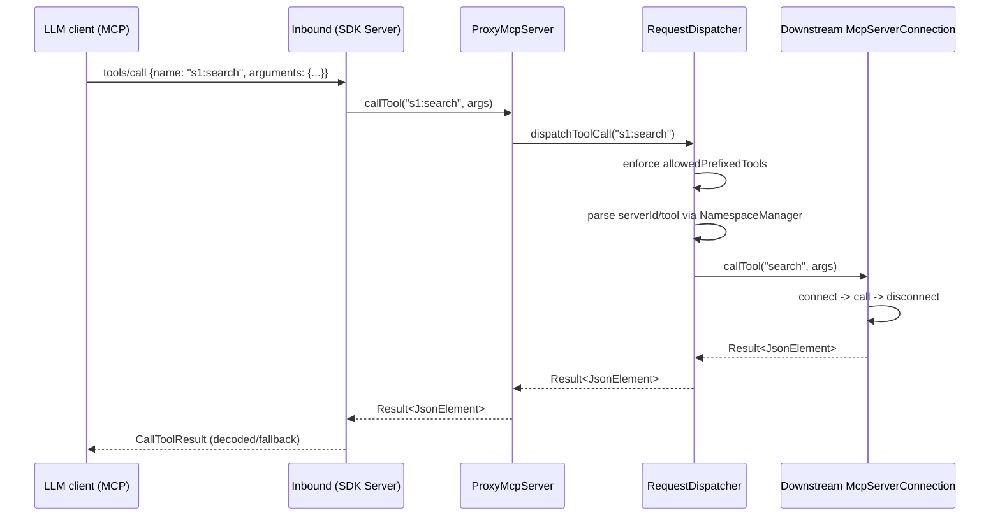

# broxy architecture (clean architecture + MCP proxy)

## Goal

broxy is a proxy for Model Context Protocol (MCP) that:

- connects to multiple downstream MCP servers (STDIO, HTTP SSE, Streamable HTTP, WebSocket);
- aggregates their capabilities (tools, prompts, resources);
- applies a preset allow list and publishes a filtered capabilities view;
- routes inbound RPCs (`tools/call`, `prompts/get`, `resources/read`) to the correct downstream server.

## Modules and layers

### `core/` (domain + data + runtime wiring)

Platform-independent proxy logic and models:

- Proxy and routing:
    - `core/src/commonMain/kotlin/io/qent/broxy/core/proxy/ProxyMcpServer.kt`
    - `core/src/commonMain/kotlin/io/qent/broxy/core/proxy/RequestDispatcher.kt`
    - `core/src/commonMain/kotlin/io/qent/broxy/core/proxy/ToolFilter.kt`
    - `core/src/commonMain/kotlin/io/qent/broxy/core/proxy/NamespaceManager.kt`
- Downstream MCP connections:
    - `core/src/commonMain/kotlin/io/qent/broxy/core/mcp/DefaultMcpServerConnection.kt`
    - `core/src/jvmMain/kotlin/io/qent/broxy/core/mcp/clients/StdioMcpClient.kt`
    - `core/src/jvmMain/kotlin/io/qent/broxy/core/mcp/clients/KtorMcpClient.kt`
    - `core/src/jvmMain/kotlin/io/qent/broxy/core/mcp/IsolatedMcpServerConnection.kt`
- Configuration and hot reload:
    - `core/src/jvmMain/kotlin/io/qent/broxy/core/config/JsonConfigurationRepository.kt`
    - `core/src/jvmMain/kotlin/io/qent/broxy/core/config/ConfigurationWatcher.kt`
    - `core/src/jvmMain/kotlin/io/qent/broxy/core/config/EnvironmentVariableResolver.kt`
- Runtime wiring (JVM):
    - `core/src/commonMain/kotlin/io/qent/broxy/core/proxy/runtime/ProxyLifecycle.kt`
    - `core/src/jvmMain/kotlin/io/qent/broxy/core/proxy/runtime/ProxyControllerJvm.kt`
    - `core/src/jvmMain/kotlin/io/qent/broxy/core/proxy/inbound/InboundServers.kt`
    - `core/src/jvmMain/kotlin/io/qent/broxy/core/proxy/inbound/SdkServerFactory.kt`

### `ui-adapter/` (presentation adapter, UDF/MVI)

Presentation layer without Compose dependencies: state, intents, and background jobs.

- Store and intents:
    - `ui-adapter/src/commonMain/kotlin/io/qent/broxy/ui/adapter/store/AppStore.kt`
    - `ui-adapter/src/commonMain/kotlin/io/qent/broxy/ui/adapter/store/internal/AppStoreIntents.kt`
    - `ui-adapter/src/commonMain/kotlin/io/qent/broxy/ui/adapter/store/internal/ProxyRuntime.kt`
- Remote mode (OAuth + WebSocket) wiring:
    - `ui-adapter/src/commonMain/kotlin/io/qent/broxy/ui/adapter/remote/RemoteConnector.kt`
    - `ui-adapter/src/jvmMain/kotlin/io/qent/broxy/ui/adapter/remote/RemoteConnectorFactoryJvm.kt`
    - `ui-adapter/src/jvmMain/kotlin/io/qent/broxy/ui/adapter/remote/BroCloudRemoteConnectorAdapter.kt`
    - UI hides remote controls when the remote connector is unavailable.

### `ui/` (Compose Desktop, thin UI)

UI renders `UIState` and calls intents, with no direct dependency on `core`.

### `cli/` (CLI mode)

CLI starts the proxy and the configuration watcher:

- `cli/src/main/kotlin/io/qent/broxy/cli/commands/ProxyCommand.kt`

## End-to-end flows

### 1) Start proxy (CLI or UI)

1. Load configuration (`mcp.json`) and preset (`preset_<id>.json`).
2. Build runtime:
    - downstream connections: `DefaultMcpServerConnection` for each enabled server;
    - proxy core: `ProxyMcpServer`;
    - inbound server: STDIO or Streamable HTTP (`InboundServerFactory`).
3. `ProxyMcpServer.start(...)` stores the preset and returns immediately; downstream
   capabilities are refreshed asynchronously per server.
4. The inbound adapter builds an MCP SDK `Server` via `buildSdkServer(proxy)` and exposes
   `tools/list`, `prompts/list`, `resources/list`, and handlers for `callTool/getPrompt/readResource`.

### 2) Tool call (LLM -> broxy -> downstream)

Key contract: inbound tool names must be prefixed as `serverId:toolName`.

### 3) Hot reload (config/preset)

`ConfigurationWatcher` is used in CLI and UI:

- `mcp.json` change -> `onConfigurationChanged(...)` -> `ProxyLifecycle.restartWithConfig(...)`.
- `preset_*.json` change -> `onPresetChanged(...)` -> `ProxyLifecycle.applyPreset(...)`.

Inbound does not restart; the SDK server is re-synced with the new filtered capabilities.
